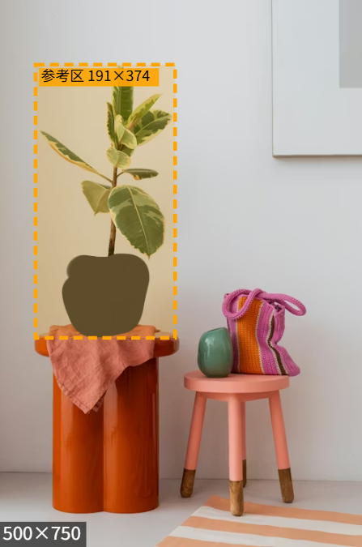
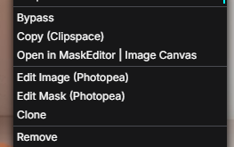
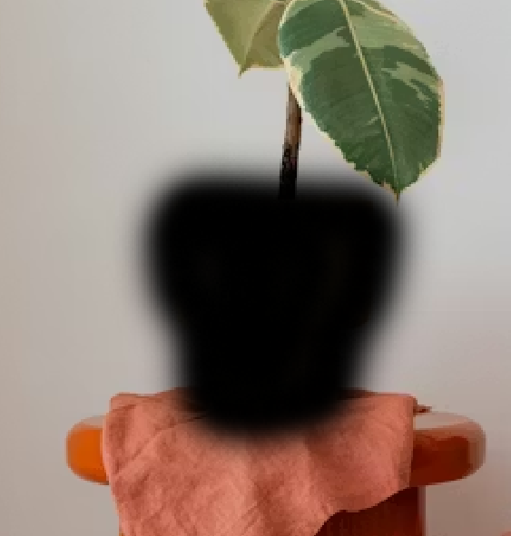
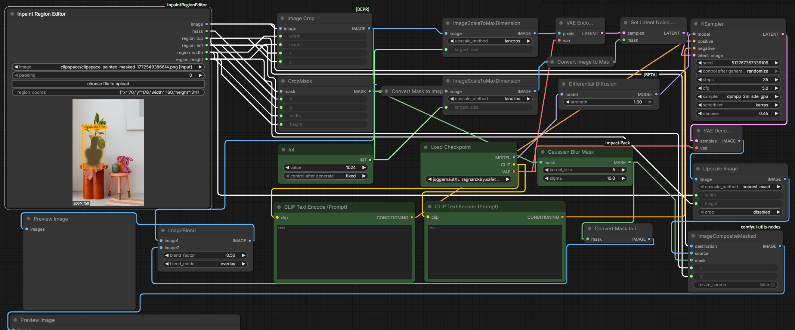

# ComfyUI Inpaint Region Editor

[](https://opensource.org/licenses/MIT)
[](https://github.com/comfyanonymous/ComfyUI)

一个用于局部重绘（Inpaint）工作流的 ComfyUI 自定义节点，集成 Photopea 图像编辑与可调整参考区功能。

---

## 核心优势

### 1. 可调整参考区方向与位置

ComfyUI 原生的局部重绘节点，参考区只能以蒙版边界为中心向外均匀扩散。这种固定模式存在以下局限：

- **边缘区域问题**：当参考区延伸至图像边界时，边界外的无效区域可能导致模型产生不理想的生成结果
- **参考方向单一**：扩散方向固定为蒙版边界的法向，无法根据图像内容灵活调整

**本节点解决方案**：支持手动拖动和调整参考区的位置与尺寸，使模型能够参考正确的图像上下文。

### 2. 集成 Photopea 图像编辑

ComfyUI 本身不具备图像编辑功能，修改源图像通常需要外部工具。

**本节点解决方案**：集成 Photopea 在线图像编辑器，支持在浏览器内完成液化、仿制图章、修补、色彩调整等专业编辑操作，编辑结果可直接保存回节点。

### 3. 专业级蒙版编辑与羽化控制

ComfyUI 内置的蒙版编辑器适用于快速操作，但在绘制复杂蒙版和精细羽化效果时功能有限，羽化效果通常依赖算法自动生成。

**本节点解决方案**：
- 提供 Photopea 双图层蒙版编辑模式
- 支持手动绘制任意形状和羽化程度的蒙版
- 羽化效果由用户精确控制，而非算法估算

---

## 功能特性

- **参考区调整** - 拖动位置、调整尺寸、约束验证
- **Photopea 图像编辑** - 液化、仿制图章、修补、滤镜等
- **Photopea 蒙版编辑** - 双图层模式，支持精确羽化控制
- **自动蒙版检测** - 从 PNG Alpha 通道自动提取蒙版
- **多语言支持** - 中英文界面，自动适配 ComfyUI 语言设置
- **快捷粘贴** - 支持 Ctrl+V 直接粘贴图像

---

## 安装

### 方法 1：ComfyUI Manager（推荐）

在 ComfyUI Manager 中搜索 "Inpaint Region Editor"。

### 方法 2：手动安装

```bash
cd ComfyUI/custom_nodes
git clone https://github.com/YOUR_USERNAME/ComfyUI-InpaintRegionEditor.git
```

重启 ComfyUI。

---

## 使用方法

### 节点界面



节点显示图像预览区域、橙色参考区框（标注尺寸）、参数控件。

### 右键菜单



| 选项 | 说明 |
|------|------|
| 编辑图像（Photopea） | 在 Photopea 中编辑图像 |
| 编辑蒙版（Photopea） | 双图层蒙版编辑模式 |

### 基本流程

1. 添加 **Inpaint Region Editor** 节点至工作流
2. 上传带 Alpha 通道的 PNG 图像（透明区域即为蒙版）
3. 节点自动提取蒙版并计算初始参考区
4. 根据需要编辑图像或蒙版（右键菜单）
5. 拖动参考区到合适位置
6. 连接输出至下游节点

### 蒙版效果



图像中的黑色区域为蒙版，指示模型需要重绘的区域。

### 参考区调整

- **移动位置**：拖动参考区内部
- **调整尺寸**：拖动边缘或角落
- **约束规则**：参考区始终包含蒙版，不超出图像边界

---

## 节点参数

### 输入

| 参数 | 类型 | 说明 |
|------|------|------|
| `image` | IMAGE | 输入图像（支持上传、粘贴） |
| `padding` | INT | 参考区扩散像素数（默认 64，范围 0-512） |

### 输出

| 输出 | 类型 | 说明 |
|------|------|------|
| `image` | IMAGE | RGB 图像（不含 Alpha） |
| `mask` | MASK | 蒙版（从 Alpha 通道提取） |
| `region_top` | INT | 参考区顶部 Y 坐标 |
| `region_left` | INT | 参考区左侧 X 坐标 |
| `region_width` | INT | 参考区宽度 |
| `region_height` | INT | 参考区高度 |

---

## 概念说明

| 概念 | 定义 | 作用 |
|------|------|------|
| **蒙版 (Mask)** | 指定需要重绘的区域 | 模型在该区域内生成新内容 |
| **参考区 (Region)** | 模型参考的图像区域 | 模型根据该区域内的原始像素进行内容生成 |

**约束关系**：参考区必须完全包含蒙版。

**计算方式**：参考区边界 = 蒙版边界框 + padding（向四周扩展）

---

## 注意事项

1. **图像格式要求**：需上传带 Alpha 通道的 PNG 图像。若图像无 Alpha 通道，节点将提示创建蒙版。

2. **网络依赖**：Photopea 从 CDN 加载，首次加载约 10MB，后续使用浏览器缓存。

3. **图像尺寸**：建议图像尺寸不超过 2048×2048，过大图像可能导致 Photopea 性能下降。

4. **参考区约束**：
   - 参考区始终包含蒙版区域
   - 参考区不会超出图像边界
   - 蒙版变化时参考区自动重新计算

5. **羽化控制**：
   - 在 Photopea 中使用半透明画笔绘制灰色区域实现羽化
   - Alpha 值 1-254 产生渐进透明过渡效果

---

## 示例工作流

本节点附带示例工作流文件 `workflow.json`，演示一套高效的局部重绘流程：



### 工作流原理

1. **区域裁剪** - 根据 `region_*` 坐标从原图中裁剪出参考区域
2. **放大处理** - 将裁剪区域放大至模型最佳工作尺寸（如 1024×1024）
3. **高分辨率重绘** - 在放大后的尺寸上进行采样，确保生成细节清晰
4. **缩小还原** - 重绘完成后缩小回原始尺寸
5. **合成回原图** - 将重绘结果精确合成回原图对应位置

### 优势

- **细节更清晰** - 重绘在高分辨率下进行，避免小尺寸采样导致的细节丢失
- **边缘更自然** - 放大后采样，缩小后合成，边缘过渡更平滑
- **适配任意尺寸** - 无论原图中重绘区域多小，都能获得高质量的生成效果

### 使用方法

将 `workflow.json` 拖入 ComfyUI 即可加载完整工作流。

---

## 致谢

- [Photopea](https://www.photopea.com/) by Ivan Kutskir
- [ComfyUI](https://github.com/comfyanonymous/ComfyUI)
- [ComfyUI-Impact-Pack](https://github.com/ltdrdata/ComfyUI-Impact-Pack)

---

## 许可证

MIT License - 详见 [LICENSE](LICENSE) 文件。

### Photopea 使用条款
- API 完全免费，支持商业用途
- 用户作品版权归用户所有
- 无强制署名要求
